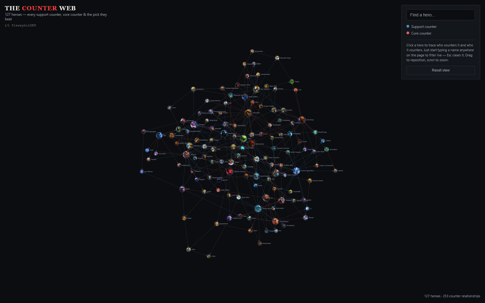
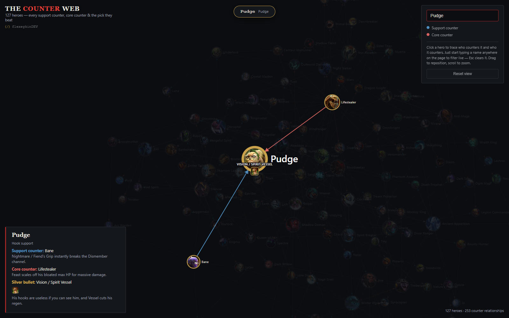

# The Counter Web

An interactive, force-directed graph of Dota 2 hero counter-picks — every support counter, every core counter, and the item that shuts each hero down.

**Live demo:** https://flexeykindev.github.io/dota-counter-web/



## Features

- **127 heroes** plotted as a force-directed graph (D3.js), with **253 counter relationships** between them
- Click any hero to trace who counters it (blue = support counter, red = core counter) and see why, plus a recommended "silver bullet" item
- Live fuzzy search — just start typing anywhere on the page to filter and jump to a hero
- Pan, zoom, and drag nodes to rearrange the graph
- Fully static — no backend, no build step, works from a single `index.html`



## Data accuracy

Counter relationships and item recommendations are verified against the current Dota 2 patch, **7.41e**. Since Dota gets reworked constantly (7.41 alone removed the old facet system in favor of one consolidated innate ability per hero), some of this will drift out of date over time — see [docs/ADDING_HEROES.md](docs/ADDING_HEROES.md) if you spot something stale and want to fix it.

## Project structure

```
.
├── index.html          # Page markup — loads the stylesheet and scripts below
├── css/
│   └── style.css        # All visual styling
├── js/
│   ├── data.js          # Hero/counter/item data (GRAPH) + hero portraits (IMAGES)
│   └── main.js           # D3 rendering, search, and interaction logic
└── docs/
    └── ADDING_HEROES.md  # Guide for adding/editing heroes, counters, and items
```

## Running locally

No build tools or dependencies required — it's a static site. Any local web server works, for example:

```bash
python -m http.server 8000
```

Then open `http://localhost:8000`.

> Opening `index.html` directly via `file://` also works in most browsers, since all data is loaded through `<script>` tags rather than `fetch`.

## Contributing

Want to add a hero, fix a counter, or update an item recommendation? See [docs/ADDING_HEROES.md](docs/ADDING_HEROES.md) for a step-by-step guide to the data format.

## Tech stack

- [D3.js v7](https://d3js.org/) (force simulation + rendering), loaded from cdnjs
- Vanilla HTML/CSS/JS — no framework, no build step

## Credits

Built by [flexeykinDev](https://github.com/flexeykinDev).
