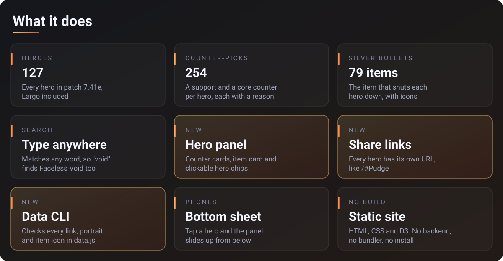

An interactive map of Dota 2 counter-picks. Click a hero to see who beats it, why, and the one item that shuts it down. 127 heroes, 254 counters, patch 7.41e.

<p>
  <a href="../../actions/workflows/check.yml"></a>
  
  
  
</p>

## Open it

<a href="https://flexeykindev.github.io/dota-counter-web/"></a>

1. Open the map.
2. Start typing a hero name anywhere on the page, or click a portrait.
3. Read the panel: who counters the hero, the silver bullet item, and who the hero counters.
4. Copy the URL to share that hero, for example [`/#Lifestealer`](https://flexeykindev.github.io/dota-counter-web/#Lifestealer).


## What it does



### New in 1.1

- Redesigned site: glass panels, animated counter arrows, a hero panel with counter cards and clickable hero chips
- Search list with portraits, arrow keys and Enter
- Search matches any word in a name, not only the start
- Share links: `#Hero_Name` in the URL opens that hero
- Zoom buttons, fit-to-screen on load and on reset, and a correct layout after resizing the window
- Phone layout with a bottom sheet
- `tools/counterweb.mjs`: checks the data, prints stats, looks up a hero in the terminal
- Hoodwink was missing a core counter. Timbersaw now fills it.

### Reading the graph

| You see | It means |
|---|---|
| Blue arrow | Support counter. The arrow points at the hero it beats |
| Red arrow | Core counter |
| Moving dashed arrow | Counters the selected hero |
| Faint dotted arrow | The selected hero counters that hero |
| Gold ring + item icons | Selected hero and its silver bullet item |
| Bigger portrait | Counters more heroes |

### Controls

| Input | Action |
|---|---|
| Type a letter anywhere | Search heroes |
| `/` | Focus the search box |
| `↑` `↓` then `Enter` | Pick from the search list |
| `Esc` | Clear search and selection |
| Click a hero, card or chip | Select that hero |
| Drag a hero | Move it |
| Scroll, or the `+` `−` buttons | Zoom |
| Fit button | Clear the selection and show the whole graph |


## Data CLI



Needs Node 18 or newer. No dependencies.

```bash
node tools/counterweb.mjs check           # fails on errors only
node tools/counterweb.mjs check --strict  # warnings fail it too
node tools/counterweb.mjs stats           # counts, most common counters and items
node tools/counterweb.mjs hero "storm"    # name, prefix or part of a name
```

`check` catches the mistakes that break the page or leave a panel half empty:

- links that point at a hero id that doesn't exist, self-links, duplicates, wrong `type`
- heroes with no support counter or no core counter
- missing portraits, broken base64, and portraits or icons that are the wrong size
- `<` or `>` in text fields
- `IMAGES` keys that don't match a hero

GitHub Actions runs `check --strict` on every push to `master` and on every pull request.

## Requirements

Any current browser. The page loads D3 from cdnjs and two fonts from Google Fonts. Hero portraits and item icons are inlined in `js/data.js`, so nothing else goes over the network. There's no tracking and nothing is stored.

<details>
<summary><b>For developers</b></summary>

### Run locally

No build step. Serve the folder with anything:

```bash
python -m http.server 8000
```

or

```bash
npm run serve
```

Then open `http://localhost:8000`. Opening `index.html` through `file://` also works, since the data loads through a `<script>` tag.

### Layout

```
.
├── index.html               page markup
├── css/style.css            all styling, colors are CSS variables on :root
├── js/
│   ├── data.js              GRAPH (heroes, links, items) and IMAGES (portraits)
│   └── main.js              D3 graph, hero panel, search, camera, share links
├── tools/counterweb.mjs     data CLI: check, stats, hero
├── .github/workflows/       CI: data check on push and PR
├── package.json             npm scripts for the CLI, no dependencies
└── docs/
    ├── ADDING_HEROES.md     data format and how to add heroes
    └── *.svg, *.png         README graphics and screenshots
```

### How it works

- `GRAPH.links` entries read as "`target` counters `source`". Arrows are drawn from the counter to the hero it beats.
- The D3 force layout runs 140 ticks before the first paint so the camera can fit the graph, then keeps settling live.
- Selecting a hero lights its links, scales the portrait up, draws the item badge under it, and writes `#Hero_Name` to the URL with `history.replaceState`.
- All panel text goes through an HTML escape before it's inserted.

### npm scripts

| Script | Runs |
|---|---|
| `npm run check` | `counterweb check --strict` |
| `npm run stats` | `counterweb stats` |
| `npm run hero -- pudge` | `counterweb hero pudge` |
| `npm run serve` | static server on port 8000 through `npx http-server` |

### Adding or fixing data

See [docs/ADDING_HEROES.md](docs/ADDING_HEROES.md), then run `npm run check`.

</details>

## Data accuracy

Counters and items match patch **7.41e**. Dota changes every patch, so some entries will go stale. If you spot one, open an issue or send a PR with the fix.

## Credits

Built by [flexeykinDEV](https://github.com/flexeykinDev). Hero portraits and item icons are from Valve's Dota 2 CDN. Dota 2 is a trademark of Valve Corporation.
