An interactive map of Dota 2 counter-picks. Click a hero to see who beats it, why, and the one item that shuts it down. The counters come from about 2 million Divine and Immortal games on patch 7.41, so every pick has real numbers behind it.

<p>
  <a href="../../actions/workflows/check.yml"></a>
  
  
  
  <a href="LICENSE"></a>
</p>

## Open it

<a href="https://flexeykindev.github.io/dota-counter-web/"></a>

1. Open the map.
2. Start typing a hero name anywhere on the page, or click a portrait.
3. Read the panel: who counters the hero, the silver bullet item, and who the hero counters.
4. Copy the URL to share that hero, for example [`/#Lifestealer`](https://flexeykindev.github.io/dota-counter-web/#Lifestealer).



## What it does


### New in 1.2

- Counters picked from match data instead of by hand: up to 3 support and 3 core counters per hero, 732 in total
- Every counter card shows its edge, win rate, number of games and pro record
- A new reason for every counter, checked against the ability text from the game files
- The graph still draws only the strongest support and core counter per hero, so it stays readable
- Clockwork, Outworld Destroyer and Ringmaster renamed to their in-game names: Clockwerk, Outworld Devourer, Ring Master

### How counters are picked

| Step | What happens |
|---|---|
| Games | Divine and Immortal public matches from STRATZ, the last 8 full weeks of patch 7.41 (Jul 16 to Sep 10, 2026) |
| Edge | How many percentage points better a hero does against this one than their usual win rates predict |
| Filter | At least 200 games in the matchup and an edge of +1.5 or more |
| Ranking | Edge minus about two standard errors, so a +8 over 250 games doesn't beat a +5 over 10k |
| Role | Support or core depends on how often the counter is played in position 4 or 5 |
| Pro record | Wins and losses in pro matches this patch from OpenDota. Shown only, too few games to rank by |

Hoodwink and Witch Doctor have no support counter that clears the bar, and Snapfire has one of each. The site shows fewer rather than padding the list.

### New in 1.1

- Redesigned site: glass panels, animated counter arrows, a hero panel with counter cards and clickable hero chips
- Search list with portraits, arrow keys and Enter
- Search matches any word in a name, not only the start
- Share links: `#Hero_Name` in the URL opens that hero
- Zoom buttons, fit-to-screen on load and on reset, and a correct layout after resizing the window
- Phone layout with a bottom sheet
- `tools/counterweb.mjs`: checks the data, prints stats, looks up a hero in the terminal
- Hoodwink was missing a core counter. Timbersaw now fills it.

### Reading the graph

| You see | It means |
|---|---|
| Blue arrow | Support counter. The arrow points at the hero it beats |
| Red arrow | Core counter |
| Moving dashed arrow | Counters the selected hero |
| Faint dotted arrow | The selected hero counters that hero |
| Gold ring + item icons | Selected hero and its silver bullet item |
| Bigger portrait | Counters more heroes |

### Controls

| Input | Action |
|---|---|
| Type a letter anywhere | Search heroes |
| `/` | Focus the search box |
| `↑` `↓` then `Enter` | Pick from the search list |
| `Esc` | Clear search and selection |
| Click a hero, card or chip | Select that hero |
| Drag a hero | Move it |
| Scroll, or the `+` `−` buttons | Zoom |
| Fit button | Clear the selection and show the whole graph |

## Data CLI


Needs Node 18 or newer. No dependencies.

```bash
node tools/counterweb.mjs check           # fails on errors only
node tools/counterweb.mjs check --strict  # warnings fail it too
node tools/counterweb.mjs stats           # counts, most common counters and items
node tools/counterweb.mjs hero "storm"    # counters with numbers and reasons
node tools/counterweb.mjs plan pudge      # what the data picks vs what data.js has
node tools/counterweb.mjs facts pudge     # ability text from the game files
node tools/counterweb.mjs apply file.json # write picked counters with your reasons
node tools/counterweb.mjs lint            # ability names in reasons that fit neither hero
```

`check` catches the mistakes that break the page or leave a panel half empty:

- links that point at a hero id that doesn't exist, self-links, duplicates, wrong `type`
- counters the matchup data doesn't back, counters listed in the wrong role, and lists out of order
- heroes missing a support or core counter when the data has one
- missing portraits, broken base64, and portraits or icons that are the wrong size
- `<` or `>` in text fields
- `IMAGES` keys that don't match a hero
- item names that don't exist in the game (short names like `BKB` and `Orchid` are allowed)

`lint` is the other half: it reads every reason and flags any ability name that belongs to neither hero in the matchup, which is how a wrong reason usually looks.

### Refreshing the numbers

```bash
cp .env.example .env   # add your free token from https://stratz.com/api
node tools/fetch-matchups.mjs
node tools/counterweb.mjs check --strict
```

Run it on the machine the token belongs to. A STRATZ token only works from the IP address that first used it, so the same token fails from a GitHub runner, a VPN or a second computer with `You cannot use different IP Addresses when using the API`. That rules out a scheduled cloud refresh unless you point the [refresh workflow](.github/workflows/refresh-data.yml) at a self-hosted runner, which is why it is manual-only.

The fetch takes about 3 minutes and stays under STRATZ's rate limit. It writes `js/matchups.js` and caches the raw data and ability text in `data-cache/`, which git ignores. If the picks changed, `check` lists what needs a new reason, `plan --json` gives you a template, and `apply` writes it in.

GitHub Actions runs `check --strict` on every push to `master` and on every pull request.

## Requirements

Any current browser. The page loads D3 from cdnjs and two fonts from Google Fonts. Hero portraits and item icons are inlined in `js/data.js`, and the matchup numbers ship in `js/matchups.js`, so nothing else goes over the network. There's no tracking and nothing is stored.

<details>
<summary><b>For developers</b></summary>

### Run locally

No build step. Serve the folder with anything:

```bash
python -m http.server 8000
```

or

```bash
npm run serve
```

Then open `http://localhost:8000`. Opening `index.html` through `file://` also works, since the data loads through a `<script>` tag.

### Layout

```
.
├── index.html               page markup
├── css/style.css            all styling, colors are CSS variables on :root
├── js/
│   ├── data.js              GRAPH (heroes, counters with reasons, items) and IMAGES (portraits)
│   ├── matchups.js          generated: matchup numbers per hero, from STRATZ and OpenDota
│   └── main.js              D3 graph, hero panel, search, camera, share links
├── tools/
│   ├── counterweb.mjs       data CLI: check, stats, hero, plan, facts, apply
│   └── fetch-matchups.mjs   pulls fresh matchup numbers (needs STRATZ_TOKEN)
├── .github/
│   ├── workflows/           CI: data check on push and PR, weekly data refresh
│   ├── ISSUE_TEMPLATE/      issue forms
│   └── PULL_REQUEST_TEMPLATE.md
├── package.json             npm scripts for the CLI, no dependencies
└── docs/
    ├── ADDING_HEROES.md     data format and how to add heroes
    └── *.svg                README graphics (showcase.svg embeds the screenshots)
```

### How it works

- `GRAPH.links` entries read as "`target` counters `source`", stored best first. Arrows are drawn from the counter to the hero it beats, and only the first support and first core link per hero is drawn.
- The panel joins each link with its row in `MATCHUPS` for the numbers, so reasons and numbers live in separate files.
- The D3 force layout runs 140 ticks before the first paint so the camera can fit the graph, then keeps settling live.
- Selecting a hero lights its links, scales the portrait up, draws the item badge under it, and writes `#Hero_Name` to the URL with `history.replaceState`.
- All panel text goes through an HTML escape before it's inserted.

### npm scripts

| Script | Runs |
|---|---|
| `npm run check` | `counterweb check --strict` |
| `npm run stats` | `counterweb stats` |
| `npm run hero -- pudge` | `counterweb hero pudge` |
| `npm run lint` | `counterweb lint` |
| `npm run fetch` | `fetch-matchups.mjs` |
| `npm run serve` | static server on port 8000 through `npx http-server` |

### Adding or fixing data

See [docs/ADDING_HEROES.md](docs/ADDING_HEROES.md), then run `npm run check`.

</details>

## Data accuracy

Counters come from Divine and Immortal games on patch **7.41**, fetched September 16, 2026. The numbers go stale as the meta shifts, so they get refreshed with `fetch-matchups.mjs`. Silver bullet items are still hand-picked. If a reason or item looks wrong, open an issue or send a PR.

## Contributing

Spotted a counter that's wrong, or a reason that misreads an ability? That's the most useful thing you can report, and you don't need to write code for it.

- [Open an issue](../../issues/new/choose): a wrong counter, a site bug, or a new patch
- [Discussions](../../discussions): argue about a matchup, or suggest where the thresholds should sit
- [CONTRIBUTING.md](CONTRIBUTING.md): how to run it, what makes a good reason, how to refresh the data
- [Code of conduct](CODE_OF_CONDUCT.md) and [security policy](SECURITY.md)

## License

[MIT](LICENSE). Dota 2 is a trademark of Valve Corporation, and this project is not affiliated with Valve.

## Credits

Built by [flexeykinDEV](https://github.com/flexeykinDev). Match data from [STRATZ](https://stratz.com) and [OpenDota](https://www.opendota.com). Hero portraits and item icons are from Valve's Dota 2 CDN. Dota 2 is a trademark of Valve Corporation.
